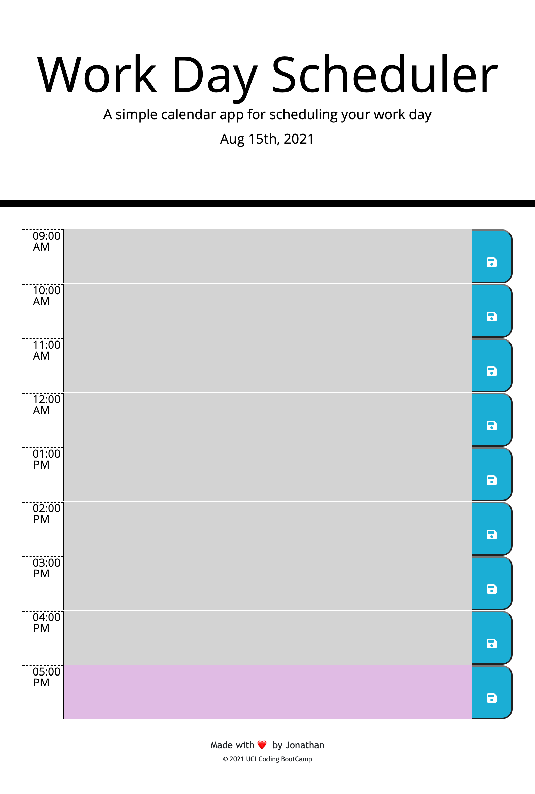

--------------------------------------

# daily-planner

The goal for this assignment was to produce a web page where a user can use a daily planner that will save a their inputs and color code the time blocks dependent on in moment time. At the end the planner should be able to save user inputs in the local storage and display it for the user until it is reset. 

--------------------------------------

## The Process 

The first step I took was working out how to display the date using the user's current day and time. For this I referred back to a previous activity that used 'moment()'. This was straightforward and done quickly. I also realized that the HTML page would be simple because the time columns would follow similar properties and the css page I noticed was a good reference for what I should include in my HTML tags for class and ID names. 

Then while I started working on the JS code I looked back at activities 21-24 to revisit jQuery and how I could use it to help figure out steps to color code the planner according to the user's present time. 

Making the save button function was not too complicated and reviewed previous activities to review how parent and sibling elements work in JQuery. 

I had the most trouble getting the time color coding function to work. Once I read about moment().hour() I realized that it works on a 0-23 range. I suspected the issue occuring came from my timeColorChange variable so I used a console.log to see what number was being returned. Once I saw NaN I noticed that the ID's I had placed needed to be changed to numbers to allow the function to compare times to color code it accordingly. 

Some resources used include: 

[Geeks for Geeks](https://www.geeksforgeeks.org/jquery-siblings-with-examples/)

[Geeks for Geeks](https://www.geeksforgeeks.org/moment-js-moment-hour-method/)

[Moment.js Documentation](https://momentjs.com/docs/)

### Navigate my page

Here is a link to my deployed page that will display a daily planner with the ability to save your input and display a color depending on the time. Gray for past, pastel purple for present, and pastel yellow for future.

[Daily Scheduler Link](https://jmonrom.github.io/daily-planner/)